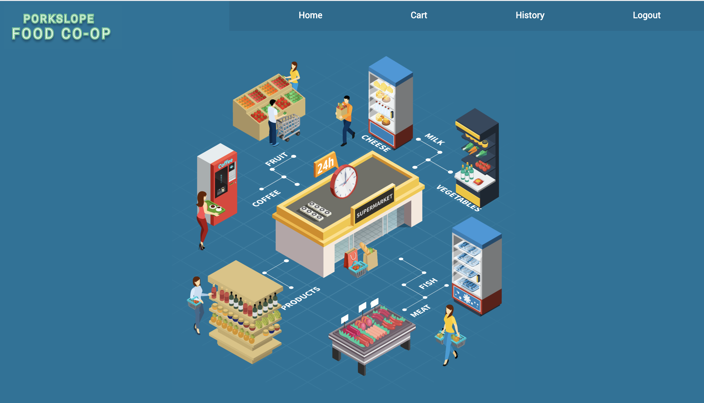

# PorkSlope

This is an application for a grocery store. With it you can create a grocery list, delete items, and be able to save it so you can review it in the future.

PorkSlope is an application for shoppers to be able to create grocery list by categories. THe grocery lists can be created with the inventroy that currently exist in the store so that shoppers don't accidently items that are currently not stocked. A shopper can view there updated cart price and once they have shopped they can save it and create a history of their expenses. 

## Installation

1. Clone repo
2. ###### `$ npm install`
     (need to have Node.js install already )
3. Clone backend repo https://github.com/guillenjs/porkslope_backend-
4. run rails seed file
    ###### `$ rails db:seed`
4. run rails server 
    ###### `$ rails s`
5. run front end repo 
    ###### `$ npm start`

## Using application

    Once installed and running you can use the user name of "Jorge" to login no password necessary.

## Tech Stack    
- Javascript
- React.js 
- Ruby on Rails API
- PostgreSQL
- CSS

## Tools
 - [React Router](https://reactrouter.com/web/guides/quick-start)
 - [ActiveModelSerializers](https://github.com/rails-api/active_model_serializers)
 - [Hover.css](https://github.com/IanLunn/Hover)
 - [Vector Stock](https://www.vectorstock.com/)

